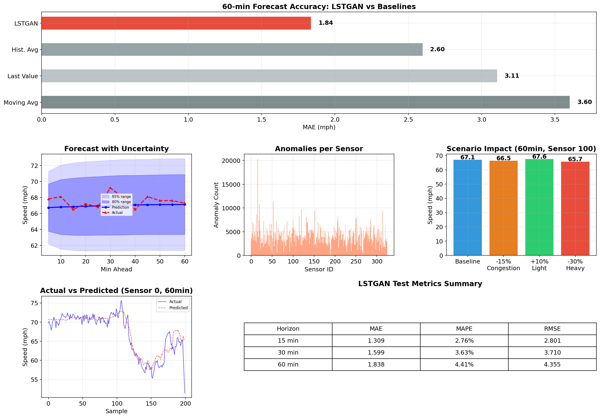
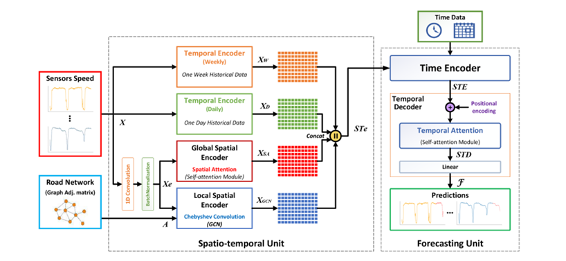

# LSTGAN Traffic Forecaster

[](https://lstgan-traffic-forecasting.streamlit.app/)
**Live Deployment:** [Test the live dashboard here!](https://lstgan-traffic-forecasting.streamlit.app/)
## 1. Overview
The **LSTGAN Traffic Forecaster** is an interactive, real-time dashboard for predicting macroscopic traffic conditions across 325 sensors in the Bay Area network. 

**What problem it solves:** Traffic congestion leads to massive economic and environmental waste. Traditional forecasting methods fail to capture both the complex geographic (spatial) topology of highways and the periodic (temporal) fluctuations of rush hours. This project solves that by deploying a state-of-the-art Spatio-Temporal Graph Attention Network to accurately predict traffic speeds up to 60 minutes into the future.

**Intended users:** City planners, traffic control centers, and logistics companies needing macro-level insights to reroute vehicles and mitigate bottlenecks before they occur.

## 2. Features
- **Dynamic 60-Minute Forecasts**: Real-time evaluation of traffic conditions up to an hour ahead.
- **Geographically Accurate Graph Mapping**: Interactive Map projecting exact network node structure onto the physical highways (US-101, I-880).
- **Per-Sensor Analytics**: Time-series charts comparing historical, actual, and predicted speeds alongside 80%/95% confidence intervals.
- **Network Congestion Analytics**: High-level summaries computing the percentage of the network in Free Flow versus Severe Gridlock.
- **Cross-Sensor Comparison**: Ability to graph up to 6 sensors simultaneously to view propagating traffic shockwaves.

## 3. Tech Stack
- **AI/ML Engine:** PyTorch (LSTGAN Architecture)
- **Frontend Dashboard:** Streamlit
- **Visualization:** Plotly Graphic Objects, Folium, Leaflet.js
- **Data Manipulation:** Pandas, NumPy, Scikit-learn
- **Dataset:** PeMS-Bay (Performance Measurement System)

## 4. Install and Run Instructions
To run this application locally, you must first have Python 3.9+ installed and clone the repository.

1. **Install dependencies**
   ```bash
   pip install -r requirements.txt
   ```

2. **Run the Streamlit Dashboard**
   ```bash
   python -m streamlit run src/app.py
   ```

3. **View the Dashboard**
   - Open your browser and navigate to `http://localhost:8501`

42: *(Note: The required pre-trained model and test dataset are already natively bundled in the `assets/` directory and will load automatically).*
## 5. Usage Examples



- **Check Rush Hour**: Use the left sidebar to select `Monday` and `08:00`. Watch the map instantly render the predicted rush hour congestion +60 mins into the future.
- **Deep Dive a Sensor**: Select `Sensor #400001` to view its specific 5-10-15-30-60 minute predictions plotted against true historic states.

## 6. Architecture Notes



Our underlying model (LSTGAN) operates using a highly advanced composite architecture:
- **Spatial Topology:** Employs Chebyshev Graph Convolutional Networks (GCN) coupled with Multi-head Self-Attention to capture immediate upstream/downstream neighbor states *and* distant structural network states simultaneously.
- **Temporal Processing:** Uses dilated 1D-convolutions with distinct paths covering Weekly, Daily, and Hourly historical timeframes.
- **Frontend Segregation:** To maintain code stability, the Streamlit app acts exclusively as the View layer (`src/app.py`), directly sourcing the computational framework from `src/model.py`.

## 7. Limitations
- **Static Dataset Integration:** Live streaming API ingestion (e.g. hooking directly into Caltrans PeMS web sockets) is pending. Predictions run on an offline high-resolution slice of `test_5min.pkl`.
- **CPU Inference Bound:** Streamlit defaults to deploying the model onto the CPU. Larger matrices may experience slow-down without an attached accelerator in production.
